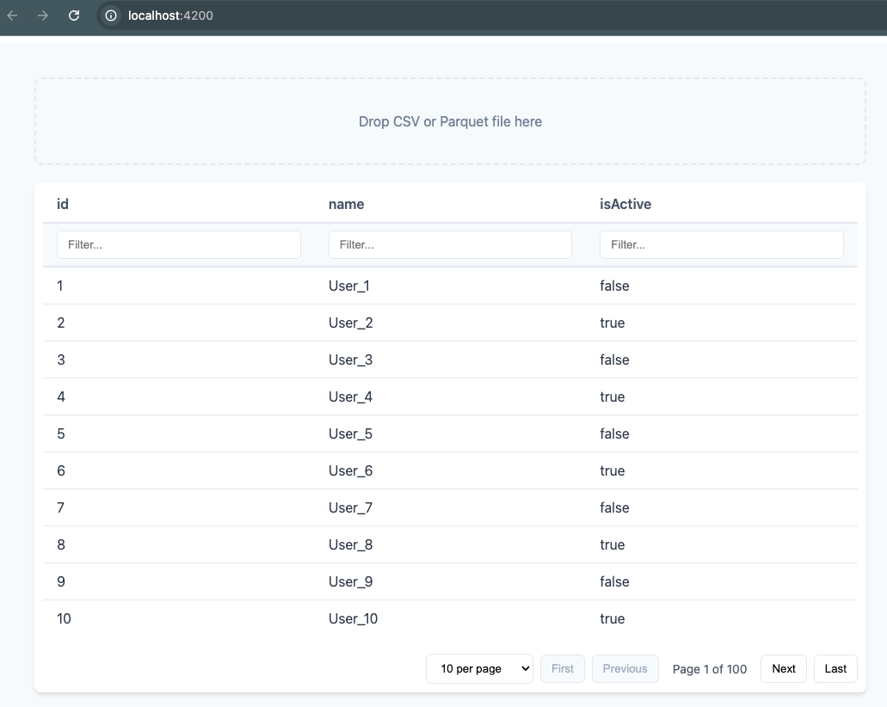

# Simple CSV and Parquet Viewer



This is a simple, client-side web application built with Angular that allows users to view CSV and Parquet files directly in their browser. It features a drag-and-drop interface for easy file loading and provides tools for data exploration like sorting, filtering, and pagination.

## Features

- **Drag and Drop:** Easily load files by dragging them onto the application window.
- **File Support:** Supports both `.csv` and `.parquet` file formats.
- **Interactive Table:** Displays data in a clean, easy-to-read table.
- **Sorting:** Click on any column header to sort the data in ascending or descending order.
- **Filtering:** Each column has its own filter input.
  - **Text search:** Simple text matching for string-based columns.
  - **Numeric queries:** Use operators like `>`, `<`, `>=`, `<=`, and `=` for numeric columns (e.g., `> 100`).
- **Pagination:** Navigate through large datasets with easy-to-use pagination controls, including options to change the number of items shown per page.

## Getting Started

Follow these instructions to get the project up and running on your local machine.

### Prerequisites

You need to have [Node.js](https://nodejs.org/) and the [Angular CLI](https://angular.io/cli) installed.

### Installation

1.  **Clone the repository:**

    ```bash
    git clone <your-repository-url>
    ```

2.  **Navigate to the project directory:**

    ```bash
    cd <project-directory>
    ```

3.  **Install NPM packages:**

    ```bash
    npm install
    ```

4.  **Run the development server:**
    ```bash
    ng serve
    ```
    Navigate to `http://localhost:4200/`. The application will automatically reload if you change any of the source files.

## Usage

1.  Open the application in your web browser.
2.  Drag and drop a CSV or Parquet file onto the designated "Drop Zone".
3.  The data will be loaded and displayed in the table.
4.  Use the column headers to sort, the input fields to filter, and the controls at the bottom to navigate through the pages.
